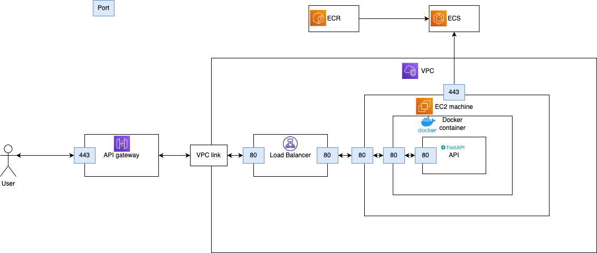

# Fraud Detector 3000

> Credit card fraud detection with ML Pipeline

# Fraud Detector 3000

## Project Overview
Fraud Detector 3000 is a comprehensive credit card fraud detection system designed with a robust machine learning pipeline. The project leverages modern technologies to ensure scalable data processing, model training, deployment, and monitoring, making it suitable for real-world financial applications.

## Technologies Used
- **Programming Language:** Python 3.12
- **Web Framework:** FastAPI
- **Machine Learning:** Scikit-learn, MLflow
- **Data Management:** DVC (Data Version Control)
- **Containerization:** Docker
- **Infrastructure as Code:** Terraform
- **Version Control:** Git
- **Static Analysis & Formatting:** Ruff, Mypy
- **Logging:** Loguru
- **Testing:** Pytest
- **Dependency Management:** uv

## Project Structure
```markdown
fraud-detector-3000/
├── Dockerfile
├── Makefile
├── README.md
├── data/
│   ├── external/
│   ├── interim/
│   ├── processed/
│   └── raw/
├── docs/
│   ├── architecture.png
│   ├── high_level_architecture.png/
│   ├── README_how_to_run.md
│   └── README_intro.md
├── metrics/
├── models/
├── notebooks/
├── src/
│   ├── __init__.py
│   ├── api/
│   │   ├── __init__.py
│   │   ├── main.py
│   │   └── types.py
│   ├── fraud_detector/
│   │   ├── __init__.py
│   │   ├── constants.py
│   │   ├── evaluate.py
│   │   ├── prepare.py
│   │   ├── train.py
│   │   └── types.py
│   ├── notebooks/
│   │   └── first_test.py
│   └── scripts/
│       ├── __init__.py
│       ├── constants.py
│       ├── evaluate_model.py
│       ├── prepare_model.py
│       ├── promote_model.py
│       └── train_model.py
├── terraform/
│   └── makefile
├── tests/
│   ├── __init__.py
│   └── api
│       ├── __init__.py
│       └── test_main.py
├── Makefile
├── Dockerfile
├── params.yaml
├── pyproject.toml


└── uv.lock
```

## Overall Pipeline

1. **Data Preparation**
   - Raw data is stored in the `data/raw/` directory.
   - The `prepare_model.py` script processes raw data, normalizes column names, and splits the data into training, validation, and testing sets using parameters defined in `PrepareModelParams`.
   - Processed data is saved in the `data/processed/` directory.

2. **Model Training**
   - The `train_model.py` script handles model training using Scikit-learn.
   - Training parameters are managed through `TrainModelParams`.
   - MLflow is integrated for experiment tracking, parameter logging, and model registration.
   - Trained models are saved locally and registered in the MLflow Model Registry, transitioning to the Production stage upon successful training.


3. **Model Evaluation**
   - The `evaluate_model.py` script handles model training using Scikit-learn.
   - Training parameters are managed through `params.yaml`.
   - MLflow is integrated for experiment tracking, parameter logging, and model registration.
   - Trained models are saved locally and registered in the MLflow Model Registry, transitioning to the Production stage upon successful training.

4. **API Deployment**
   - A FastAPI-based API is developed to serve the trained model for batch predictions.
   - The API code resides in the `src/api/` directory.
   - Docker is used to containerize the API, with a multi-stage `Dockerfile` ensuring a lightweight image.
   - The API is deployed using Docker Compose, with health checks to ensure reliability.

5. **Infrastructure Management**
   - Terraform is utilized to provision and manage AWS infrastructure required for the project.
   - Infrastructure code is organized within the `terraform/` directory, enabling reproducible deployments.

6. **Data Versioning**
   - DVC manages data versioning, ensuring that data transformations and model versions are tracked and reproducible.

7. **Testing and Quality Assurance**
   - Pytest is used for unit testing, ensuring code reliability.
   - Ruff and Mypy enforce code formatting and type checking, maintaining code quality.
   - Git hooks are installed to automate checks before commits and pushes.

8. **Continuous Integration and Deployment**
   - Makefile scripts facilitate common tasks such as installing dependencies, running tests, formatting code, and deploying the API.
   - The pipeline ensures that changes are consistently tested and deployed, minimizing downtime and errors.

## Cavehats and TODO
* Fix the GitHub actions to properly set up the aws credentials
* Host a dediacted mlflow server so the API can benefit from the Mlflow registery


## Project requirements
### uv

- Install [uv](https://example.com/uv) to manage your dependencies and tooling configs:

  ```bash
  curl -sSL https://install.uv.com | sh -s -- --version 1.7.0
  ```

  *If you have not previously installed any Python version, you may need to set your global Python version before installing uv:*

    ```bash
    pyenv global 3.11.6
    ```


### Docker Engine

Install [Docker Engine](https://docs.docker.com/engine/install/) to build and run the API's Docker image locally.

### AWS Command Line Interface

Install [AWS CLI](https://docs.aws.amazon.com/cli/latest/userguide/getting-started-install.html) to be able to interact
with AWS services from your terminal.

### Terraform and associated tools

To manage the project infrastructure, you will need to install:

- [Terraform](https://developer.hashicorp.com/terraform/tutorials/aws-get-started/install-cli#install-terraform)
- [TFlint](https://github.com/terraform-linters/tflint#installation)
- [terraform-docs](https://github.com/terraform-docs/terraform-docs#installation)

## Installation

### Python virtual environment and dependencies

1. Install  and environment with `uv`:

    ```bash
    uv sync
    ```

Or

```bash
make install
```


### Setup environment variables

Duplicate the `.env.example` file and rename it to `.env`. Fill in the environment variables with the right values.

Make sure to install [direnv](https://github.com/direnv/direnv/tree/master) to load the environment variables automatically whenever you enter the project directory.
On MacOS, you can install it with Homebrew:

```bash
brew install direnv
```

### Setup AWS for your project

Set up your AWS account locally to be able to access the different resources:

- Get your AWS credentials from the AWS console, or ask an administrator to provide them to you.
- If you are managing only this AWS account in your computer
  - Run `aws configure` and specify your ACCESS_KEY_ID and SECRET_ACCESS_KEY
- If you are managing several AWS accounts in your computer
  - Modify your local file located in `~/.aws/credentials` to add:

    ```bash
    [fraud-detector-3000]
    aws_access_key_id=XXXXXX
    aws_secret_access_key=XXXXXXXX
    region=us-east-2
    ```

  - *(Optional)* In your IDE, modify the default terminal env variables of your project to add `AWS_PROFILE=fraud-detector-3000`.
  It allows you to use the right AWS profile when calling Python files.

### Set-up Terraform

*All commands below are to be run from `terraform` folder.*

- Init the project locally:

  ```bash
  terraform init
  ```

- Install TFlint plugins:

  ```bash
  tflint --init
  ```

- Select the development workspace:

  ```bash
  terraform workspace select dev
  ```


### Install git hooks (running before commit and push commands)

```bash
poetry run pre-commit install
```

### Setup MLflow Tracking URI

To configure local MLflow tracking, run:
```bash
export MLFLOW_TRACKING_URI=http://localhost:5000
```

### Pull data from DVC remote

- Make sure you have access to the DVC remote bucket (see bucket URL in `.dvc/config` file). If not, ask an administrator to give you access.
- Pull the data:

  ```bash
  uv run dvc pull
  ```

### Rerunning the Pipeline with DVC

To rerun the entire pipeline, execute the following command:

```bash
uv run dvc repro
```

This command will sequentially run all stages defined in `dvc.yaml`, including data preparation, model training, and evaluation. Ensure that all dependencies are up-to-date before rerunning the pipeline.

If you need to rerun a specific stage, specify the stage name:

```bash
uv run dvc repro <stage_name>
```

For example, to rerun the training stage:

```bash
uv run dvc repro train
```

Or you can just use:

```bash
make repro
```
## Testing

To run unit tests, run `pytest` with:

```bash
pytest tests --cov src
```

or

```bash
make test
```

## Formatting and static analysis

### Code formatting with `ruff`

To check code formatting, run `ruff format` with:

```bash
uv run ruff format --check .
```

or

```bash
make format-check
```

You can also [integrate it to your IDE](https://docs.astral.sh/ruff/integrations/) to reformat
your code each time you save a file.

### Static analysis with `ruff`

To run static analysis, run `ruff` with:

```bash
uv run ruff check src tests
```

or

```bash
make lint-check
```

To run static analysis and to apply auto-fixes, run `ruff` with:

```bash
make lint-fix
```

### Type checking with `mypy`

To type check your code, run `mypy` with:

```bash
uv run mypy src --explicit-package-bases --namespace-packages
```

or

```bash
make type-check
```


## API

The project includes an API built with [FastAPI](https://fastapi.tiangolo.com/). Its code can be found at `src/api`.

The API is containerized using a [Docker](https://docs.docker.com/get-started/) image, built from the `Dockerfile` and `docker-compose.yml` at the root.

To build and start the API, use the following Makefile command:

```bash
make start-api
```

You can test the `hello_world` route by [importing the Postman collection](https://learning.postman.com/docs/getting-started/importing-and-exporting-data/#importing-postman-data) at `postman`.

For more details on the API routes, check the automatically generated [swagger](https://learning.postman.com/docs/getting-started/importing-and-exporting-data/#importing-postman-data) at the `/docs` url.

### Deploy the API

To deploy the API, run (depending on your computer's architecture):

```bash
make deploy-api-from-x86 # E.g. Linux or Mac intel
```

or

```bash
make deploy-api-from-arm # E.g. Mac M1 or M2
```


## Infrastructure

The infrastructure of the project consists of AWS resources, provisioned with Terraform.
The Terraform code for all resources can be found in the `terraform` folder.

### Architecture and communication between the components



### Pricing of the infrastructure


- EC2: ~38$ per month. ([see official doc](https://aws.amazon.com/ec2/pricing/on-demand/))
- Application Load Balancer: ~16$ per month. ([see official doc](https://aws.amazon.com/elasticloadbalancing/pricing/))
- API gateway: free for the first 1M requests per month, then ~$1 per million requests  ([see official doc](https://aws.amazon.com/api-gateway/pricing/))
- ECR: <1$ per month. ([see official doc](https://aws.amazon.com/ecr/pricing/))
- S3: <1$ per month. ([see official doc](https://aws.amazon.com/s3/pricing/))
- ECS, VPC, ASG: Free (no overhead charge)

### Process to add/delete/update resources

Select the environment you want to provision:

```bash
terraform workspace select <env_name>
```

Then check the module adding/deletion plan

  ```bash
  terraform plan
  ```

If the plan suits what you were expecting, provision the development environment by running:

  ```bash
  terraform apply
  ```

## MLflow Integration

Added local MLflow tracking with runs stored in the `mlflow/mlruns` directory.

- MLflow Tracking URI is set to `mlflow/mlruns`
- Ensure `mlflow` is included in `.gitignore`
